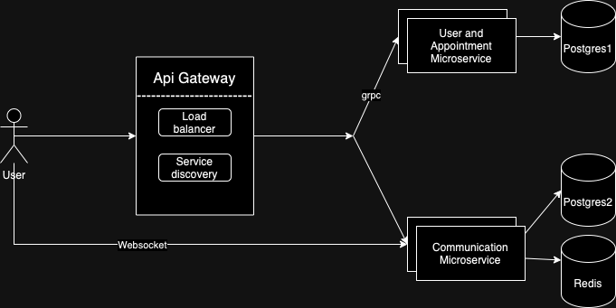

# Course: PAD

## Author: Dionisie Spataru FAF-211

## Barbershop Appointment Platform README

## Application Suitability

### Why is this application relevant?
Managing appointments for barbershops can be challenging with manual processes leading to inefficiencies and miscommunication. A web-based platform that allows customers to book appointments, get real-time updates, and communicate with barbers simplifies the process. This platform provides both customers and barbers with a reliable and efficient way to manage scheduling and communication, improving overall service quality.

### Why does this application require microservice architecture?
While a single monolithic application could handle everything, dividing the platform into two microservices allows for better performance and scalability. By separating real-time communication (through WebSockets) and core functionalities (using gRPC), you ensure the platform can efficiently handle high traffic, ensure real-time updates, and reduce latency. Each service can be scaled independently based on demand.

## Service Boundaries



---

## Service Boundaries

### Architecture Overview
- **Core User and Appointment Management Service (gRPC)**: Handles user management, appointment booking.
- **Real-time Communication Service (WebSockets)**: Manages real-time messaging and notifications for barbers and customers about appointment status changes.

### Service 1: Core Appointment Management Service (gRPC)
- **Responsibilities**: 
    - Handles user registration, login, and profile management.
    - Manages appointments (booking, modifying, canceling).
- **Technology Stack**:
    - **Backend**: Python (FastAPI with gRPC)
    - **Database**: PostgreSQL (for storing user data and appointments)
- **Communication**: Exposes gRPC endpoints for client applications (such as web and mobile) to interact with core functionalities.

### Service 2: Real-time Communication Service (WebSockets)
- **Responsibilities**:
    - Handles real-time communication between barbers and customers.
    - Provides live updates for appointment status (e.g., confirmations, cancellations).
    - Sends instant notifications for last-minute changes (e.g., schedule updates).
- **Technology Stack**:
    - **Backend**: C# (ASP.NET Core with WebSocket support)
    - **Cache**: Redis (for storing live WebSocket session data)
    - **Messaging**: RabbitMQ (for asynchronous messaging between services)
- **Communication**: WebSocket connections are used for delivering real-time updates and messages between the platform and users.

---

## gRPC API Definitions

### User Management
```proto
service UserService {
    rpc SignUp(SignUpRequest) returns (SignUpResponse);
    rpc Login(LoginRequest) returns (LoginResponse);
    rpc GetUserProfile(GetUserProfileRequest) returns (UserProfile);
}

message SignUpRequest {
    string username = 1;
    string email = 2;
    string password = 3;
}

message SignUpResponse {
    bool success = 1;
    string message = 2;
}

message LoginRequest {
    string email = 1;
    string password = 2;
}

message LoginResponse {
    string token = 1;
    string message = 2;
}

message GetUserProfileRequest {
    string token = 1;
}

message UserProfile {
    string username = 1;
    string email = 2;
    repeated string appointments = 3;
}
```

## WebSocket API Definitions

```json

{
  "type": "appointment_confirmation",
  "appointment_id": "12345",
  "status": "confirmed",
  "message": "Your appointment is confirmed for 2024-09-25 at 15:00."
}

{
  "type": "appointment_cancellation",
  "appointment_id": "12345",
  "status": "canceled",
  "message": "Your appointment has been canceled."
}

{
  "type": "chat_message",
  "sender": "Barber A",
  "message": "Can you come in 10 minutes earlier?"
}

{
  "type": "notification",
  "message": "Reminder: Your appointment is tomorrow at 15:00",
  "status": "unread"
}

```

## Deployment and Scaling

### Deployment

Both the Core Appointment Management Service (gRPC) and the Real-time Communication Service (WebSockets) will be containerized using Docker. Each service runs in a separate Docker container to maintain isolation, ensuring smooth development and deployment processes.

### Scaling

Both microservices will be horizontally scaled using Kubernetes, ensuring the platform can handle traffic spikes efficiently.